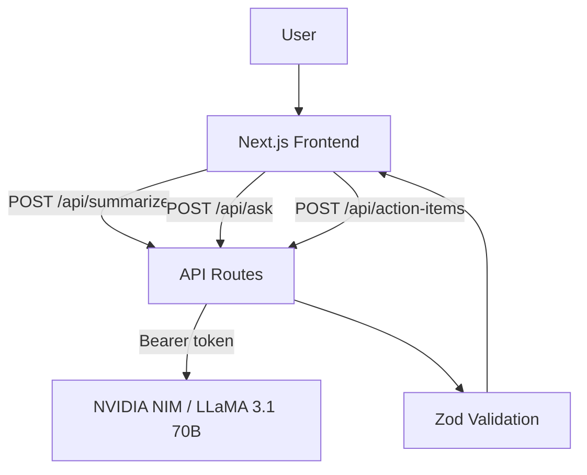

# CampusOps AI Architecture

## System design
1. Frontend pages collect tasks, notes, and user questions.
2. API routes validate request shape and size.
3. AI service layer executes structured summarization / Q&A.
4. Retrieval utility ranks docs for grounded answers.
5. UI renders concise outputs and citations.

## Components
- `app/workspace/*` — UI workflows and dashboard pages
- `app/api/*` — backend API routes
- `lib/ai.ts` — model integration + fallback logic
- `lib/retrieval.ts` — keyword overlap ranking for RAG-lite
- `lib/demoData.ts` — seeded demo workspace

## Reliability
- Input validation in every AI API route
- Deterministic fallback responses if no model key
- Clear client-side loading and error states

## Scale path
- Replace seeded data with Postgres + Prisma data layer
- Add auth + role-based access control
- Replace simple retriever with embeddings + vector DB
- Add async job queue for large document ingestion

## System Architecture Diagram

